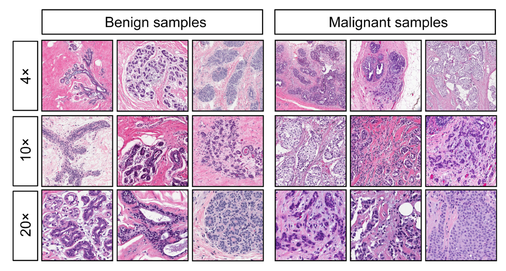

```{r setup, include=FALSE}
knitr::opts_chunk$set(echo = TRUE)
knitr::opts_chunk$set(fig.align = "center")
library(ggplot2)
library(dplyr)
library(tidyr)
library(gridExtra)
library(corrplot)
library(reshape2)
library(RColorBrewer)
library(GGally)
library(rnaturalearth)
library(cowplot)
library(MASS)
library(knitr)
library(rstan)
library(bayesplot)
library(posterior)
library(caret)
library(tidybayes)
library(e1071)
library(randomForest)
```

# Introduction

Breast cancer is a significant health concern, affecting approximately 2.3 million women annually worldwide and resulting in over 680,000 deaths each year. Early and accurate diagnosis is crucial for effective treatment and improving survival rates. Traditional diagnostic methods, such as clinical examinations and imaging, while essential, often suffer from limitations. These traditional approaches can be subjective, heavily dependent on the clinician's experience, and may lack strict probabilistic interpretation, leading to variability in diagnosis and potential for false positives and negatives.

In contrast, Bayesian methods offer a systematic approach that addresses these limitations. Bayesian inference incorporates prior knowledge and continuously updates predictions with new data, providing a probabilistic framework that quantifies uncertainty. This approach enhances prediction accuracy and offers reliable uncertainty estimates, making it particularly suitable for medical decision-making where certainty and precision are paramount.

In this project, we mainly apply Bayesian logistic regression to predict whether breast tumors are malignant or benign based on clinical and imaging features. By leveraging Bayesian methods, we aim to enhance the standard logistic regression model to incorporate prior knowledge and assess prediction uncertainty. Our goal is to improve diagnostic accuracy and reliability, supporting more informed clinical decisions.

# Data Description

```{r}
raw_data <- read.csv("breast_cancer.csv")
raw_data <- raw_data[, !(names(raw_data) %in% c("id", "X"))]
raw_data$diagnosis <- ifelse(raw_data$diagnosis == "M", 1, 0)
dim(raw_data)
```

We will use the `Breast Cancer Wisconsin (Diagnostic)` dataset\hyperlink{ref1}{[1]}. After dropping column `id` and `X`(empty column), there are 569 instances and 31 columns. The `diagnosis` column contains **M** and **B**, which means **malignant** and **benign**, and we use **1** and **0** to replace them respectively. The rest columns are features, computed from a digitized image of a fine needle aspirate (FNA) of a breast mass (see Figure \@ref(fig:samples)). They describe characteristics of the cell nuclei present in the image. The **mean**, **standard error** and **worst** or largest (mean of the three largest values) of these features were computed for each image, resulting in 30 features.

```{r echo=FALSE}
feature_descriptions <- data.frame(
  Feature = c("radius", "texture", "perimeter", "area",
              "smoothness", "compactness","concavity", "concave.points",
              "symmetry", "fractal_dimension"),
  Description = c(
    "Mean of distances from center to points on the perimeter (Radius)",
    "Standard deviation of gray-scale values (Texture)",
    "Perimeter of the cell nuclei",
    "Area of the cell nuclei",
    "Local variation in radius lengths (Smoothness)",
    "Compactness (calculated as perimeter^2 / area - 1.0)",
    "Severity of concave portions of the contour (Concavity)",
    "Number of concave portions of the contour (Concave points)",
    "Symmetry of the cell nuclei",
    "Fractal dimension (calculated as 'coastline approximation' - 1)"
  )
)
knitr::kable(feature_descriptions, caption = "Description of Features in the Dataset", booktabs = TRUE, position = 'H')
```

```{r samples, echo=FALSE, out.width="90%", out.height="90%", fig.cap="Image Samples"}

```

Next, we check the data set for missing values.
```{r}
sum(is.na(raw_data))
```
Great! There are no missing values in this dataset.

# Exploratory Data Analysis
In this section, we conduct Exploratory Data Analysis to better understand the dataset. We will visualize some variables' distributions to identify patterns and trends. To aid in feature selection, we create a correlation heatmap to highlight highly correlated features, helping us to remove redundant features. This analysis provides essential insights for our Bayesian modeling approach.

## Normalization
Normalization is essential to ensure that all features in the dataset contribute equally to the model. By rescaling features to a standard range, we eliminate differences in scales and units, which improves model performance and stability. This preprocessing step enhances the accuracy and reliability of our predictions.
```{r}
diagnosis <- raw_data[, 1]
X <- raw_data[, -1]
X <- scale(X, center = TRUE, scale = TRUE)
normal_data <- data.frame(diagnosis,X)
```

## Visualization of some Distributions
First, we examine the distribution of `diagnosis` in the dataset. The plot shows the count of benign (0) and malignant (1) diagnoses. We observe that there are 357 (62.74%) benign cases and 212 (37.26%) malignant cases, indicating an imbalance in the dataset. Specifically, we need to be careful about our evaluation metrics later on, such as precision, recall, and others, to ensure they appropriately reflect the model's performance given the class imbalance.

```{r out.width="60%", out.height="60%", echo=FALSE}
counts <- table(raw_data$diagnosis)
plot_data <- as.data.frame(counts)
plot_data$diagnosis <- as.factor(plot_data$Var1)
ggplot(plot_data, aes(x = diagnosis, y = Freq, fill = diagnosis)) +
  geom_bar(stat = "identity", width = 0.7, alpha = 0.6) +
  scale_fill_manual(values = c("0" = "skyblue", "1" = "salmon"), labels = c("0 = B", "1 = M")) +
  labs(title = "Distribution of Diagnosis", x = "Diagnosis", y = "Count", fill = "Diagnosis") +
  geom_text(aes(label = Freq), vjust = -0.5, size = 5) +
  theme_light()+
  ylim(0, max(counts) * 1.2) +
  theme(
    plot.title = element_text(hjust = 0.5, size = 12),
    axis.title.x = element_text(size = 12),
    axis.title.y = element_text(size = 12),
    axis.text.x = element_text(size = 10),
    axis.text.y = element_text(size = 10)
  )
```
More specifically, considering the reality, the proportion of benign tumors is much higher than that of malignant tumors. So we need to use such metrics:

1. **Recall**: Recall indicates the proportion of actual malignant tumors that are correctly identified as malignant. This metric is critical because it reflects the model's ability to minimize false negatives, thereby reducing the likelihood of missing malignant tumors which could delay necessary treatment.

2. **Precision**: Precision represents the proportion of tumors identified as malignant that are indeed malignant. This is equally important as it ensures that the number of false positives is minimized, thereby avoiding unnecessary treatments and psychological stress for patients with benign tumors.

While **accuracy** is also an important metric, it is relatively less significant in the context of tumor detection. This is due to the typically higher prevalence of benign tumors compared to malignant ones. A high accuracy could potentially mask the model's inadequacy in detecting malignant tumors because the large number of correctly identified benign tumors can dominate the metric.


```{r out.width="85%", out.height="85%", echo=FALSE}
violin_data <- normal_data
violin_data$diagnosis <- factor(violin_data[[1]], levels = c(0, 1), labels = c("Benign", "Malignant"))
violin_long <- reshape2::melt(violin_data, id.vars = "diagnosis", measure.vars = 2:11, variable.name = "Feature", value.name = "Value")
ggplot(violin_long, aes(x = Feature, y = Value, fill = diagnosis)) +
  geom_violin(trim = FALSE, draw_quantiles = c(0.25, 0.5, 0.75),
              scale = "width", position = position_dodge(width = 0.7), alpha = 0.6) +
  scale_fill_manual(values = c("Benign" = "skyblue", "Malignant" = "salmon")) +
  labs(title = "Violin plots of Features by Diagnosis", x = "Features", y = "Value") +
  theme_light() +
  theme(axis.text.x = element_text(angle = 45, hjust = 1))+
  theme(
    plot.title = element_text(hjust = 0.5, size = 12),
    axis.title.x = element_text(size = 12),
    axis.title.y = element_text(size = 12),
  )+
  stat_summary(fun = mean, geom = "crossbar", position = position_dodge(width = 0.7), 
               width = 0.6, color = "red", linewidth = 0.4, show.legend = FALSE)
```

Next, we use violin plots to visualize the distribution of various features, stratified by diagnosis (benign vs. malignant). These plots provide a detailed view of the distribution shape, central tendency, and spread of each feature. The red line is the mean, and the three black lines are the quartiles. We observe distinct patterns and separations between benign and malignant cases for several features, indicating their potential importance in distinguishing between the two classes. Additionally, we note that the features are not skewed enough to warrant transformation. The violin plots for the remaining features exhibit similar patterns, so they are not shown here for simplicity. This visualization helps in understanding the variability and distribution of features, guiding the subsequent steps in feature selection and model development.

## Variable Selection with Correlation Heatmap
We will use a correlation heatmap to identify and remove highly correlated features from the dataset, reducing multicollinearity and simplifying our model. After this preliminary selection, we fit the Bayesian logistic regression model using the remaining features. This approach ensures that we retain the most informative features, enhancing the model's accuracy and interpretability.

```{r fig.height=12, fig.width=12, echo=FALSE}
cor_matrix <- cor(X, use = "complete.obs")
melted_cor_matrix <- melt(cor_matrix)
color_palette <- colorRampPalette(brewer.pal(11, "RdYlBu"))(100)
ggplot(data = melted_cor_matrix, aes(Var1, Var2, fill = value)) +
  geom_tile(color = "white") +
  geom_text(aes(label = sprintf("%.2f", value)), size = 3, color = "black") +
  scale_fill_gradientn(colors = color_palette, name="Pearson\nCorrelation") +
  theme_bw(base_size = 12) +
  theme(axis.text.x = element_text(angle = 45, vjust = 1, face = "bold", hjust = 1),
        axis.text.y = element_text(face = "bold"),
        plot.title = element_text(hjust = 0.5)) +
  coord_fixed() +
  labs(x = "", y = "", title = "Correlation Heatmap")
```

From the plot, we can see some features are highly correlated. For example, `area_mean` are correlated with `radius_mean` and `perimeter_mean` (both 0.99). Then we choose to use only `area_mean` because it may give more information. Note that there is no absolutely correct answer for variable selection. Finally, we choose the following features: `texture_mean`, `area_mean`, `smoothness_mean`, `concavity_mean`, `symmetry_mean`, `fractal_dimension_mean`, `texture_se`, `area_se`, `smoothness_se`, `concavity_se`, `symmetry_se`, `fractal_dimension_se`, `smoothness_worst`, `concavity_worst`, `symmetry_worst`, `fractal_dimension_worst`.  

Then we check the correlation heatmap for them. We can see from the plot that the multicollinearity problem has been improved a lot.

```{r fig.height=8, fig.width=8, echo=FALSE}
columns_to_select <- c("diagnosis", "texture_mean", "area_mean", "smoothness_mean", "concavity_mean", "symmetry_mean", "fractal_dimension_mean", 
                       "texture_se", "area_se", "smoothness_se", "concavity_se", "symmetry_se", "fractal_dimension_se", 
                       "smoothness_worst", "concavity_worst", "symmetry_worst", "fractal_dimension_worst")
selected_data <- normal_data[, columns_to_select]
X <- selected_data[, -1]
cor_matrix <- cor(X, use = "complete.obs")
melted_cor_matrix <- melt(cor_matrix)
color_palette <- colorRampPalette(brewer.pal(11, "RdYlBu"))(100)
ggplot(data = melted_cor_matrix, aes(Var1, Var2, fill = value)) +
  geom_tile(color = "white") +
  geom_text(aes(label = sprintf("%.2f", value)), size = 3, color = "black") +
  scale_fill_gradientn(colors = color_palette, name="Pearson\nCorrelation") +
  theme_bw(base_size = 12) +
  theme(axis.text.x = element_text(angle = 45, vjust = 1, face = "bold", hjust = 1),
        axis.text.y = element_text(face = "bold"),
        plot.title = element_text(hjust = 0.5)) +
  coord_fixed() +
  labs(x = "", y = "", title = "Correlation Heatmap")
```

# Model Descriptions

## Bayesian Logistic Regression

Bayesian Logistic Regression is a probabilistic approach to binary classification. In this model, we estimate the probability that a given instance belongs to a particular class. Let $X = \{\vec{1}, X_1, X_2, \ldots, X_p\}$ denote the set of predictor variables and $y$ the binary response variable where $y \in \{0, 1\}$, with 0 representing benign and 1 representing malignant diagnoses.

The logistic regression model can be defined as:
$$
\Pr(y = 1 \mid X, \beta) = \frac{1}{1 + \exp(-X \beta )}
$$

where $\beta = \{\beta_0, \beta_1, \ldots, \beta_p\}$ are the coefficients to be estimated.

In the Bayesian framework, we place prior distributions on the coefficients $\beta$, which we will talk about later. The likelihood function for the logistic regression model is:
$$
\mathcal{L}(y \mid X, \beta ) = \prod_{i=1}^{n} \left( \frac{1}{1 + \exp(-X_i \beta)} \right)^{y_i} \left( 1 - \frac{1}{1 + \exp(-X_i \beta)} \right)^{1 - y_i}
$$

The posterior distribution of the coefficients $\beta$ is then obtained by combining the prior and the likelihood:
$$
p(\beta \mid X, y) \propto \mathcal{L}(y \mid X, \beta ) \cdot p(\beta)
$$

We can incorporate prior knowledge about the relationships between features and the diagnosis outcome, and obtain a full posterior distribution over the model parameters. This approach provides a measure of uncertainty in our estimates, which is particularly valuable for medical decision-making.

Next, we will choose different priors for this model. Since we don't have any prior information, we will explore three common types of priors: Gaussian, Laplace, and Cauchy. We assume $\beta_j$ are i.i.d. for all these priors. Since we have standardized the data, we will refer to this in the selection of prior parameters. Additionally, we assume the prior for $\alpha$ is $\mathcal{N}(0,10^2)$. Here $\alpha$ is actually the intercept $\beta_0$, since our $X$ used in the following code does not have the intercept column.

### Gaussian Prior

The Gaussian prior is one of the most commonly used priors due to its convenient mathematical properties and interpretability. In our hierarchical model, we assume:
$$
\begin{aligned}
\beta_j \mid \theta, \sigma^2 &\sim \mathcal{N}(\theta, \sigma^2)\\
\theta \mid \sigma^2 &\sim \mathcal{N}(0, \frac{\sigma^2}{4})\\
1/\sigma^2 &\sim \text{Gamma}(4, 4)
\end{aligned}
$$


### Laplace Prior

The Laplace prior is commonly used in Lasso regression due to its property of inducing sparsity in the coefficient estimates. Here we assume:
$$
\begin{aligned}
\beta_j \mid b &\sim \text{Laplace}(0, b)\\
b &\sim \mathcal{N}(2,1)
\end{aligned}
$$


### Cauchy Prior

The Cauchy prior is a heavy-tailed distribution that allows for occasional large coefficients, making it less restrictive than the Gaussian or Laplace priors. It is also proper\hyperlink{ref2}{[2]}. Here we assume:
$$
\begin{aligned}
\beta_j \mid \gamma &\sim \text{Cauchy}(0, 2)\\
\gamma &\sim \mathcal{N}(2,1)
\end{aligned}
$$

## Support Vector Machine
Support Vector Machine (SVM) is a powerful supervised learning algorithm used for classification and regression tasks. SVM works by finding the hyperplane that best separates the data into different classes with the maximum margin. It is particularly effective in high-dimensional spaces and is robust to overfitting.

## Random Forest
Random Forest is an ensemble learning method that combines multiple decision trees to improve classification or regression accuracy. Each tree in the forest is trained on a random subset of the data and features, and the final prediction is made by aggregating the predictions from all the trees. This approach reduces overfitting and enhances generalization, making Random Forest a versatile and widely used machine learning technique.

*The two machine learning methods mentioned above are only as a supplement and contrast, and this project is still mainly studying the model under the Bayesian framework.*

# Stan Code
```{r echo=FALSE}
stan_Gaussian <- "
data {
    int<lower=0> N; // number of data points
    int<lower=0> K; // number of features
    int<lower=0, upper=1> y[N]; // response variable
    matrix[N, K] X; // predictor variables
}

parameters {
    real alpha; // intercept
    vector[K] beta; // coefficients
    real<lower=0> sigma2; // variance parameter for beta
    real theta; // mean parameter for beta
}

model {
    // Priors
    alpha ~ normal(0, 10);
    theta ~ normal(0, sqrt(sigma2 / 4));
    1 / sigma2 ~ gamma(4, 4);
    for (j in 1:K)
        beta[j] ~ normal(theta, sqrt(sigma2));
    
    // Likelihood
    y ~ bernoulli_logit(alpha + X * beta);
}

generated quantities {
    vector[N] y_pred;
    for (n in 1:N) {
        real logit_p = alpha + dot_product(X[n], beta);
        if (logit_p > 20) {
            y_pred[n] = bernoulli_rng(1);
        } else if (logit_p < -20) {
            y_pred[n] = bernoulli_rng(0);
        } else {
            y_pred[n] = bernoulli_logit_rng(logit_p);
        }
    }
}
"

stan_Laplace <- "
data {
    int<lower=0> N; // number of data points
    int<lower=0> K; // number of features
    int<lower=0, upper=1> y[N]; // response variable
    matrix[N, K] X; // predictor variables
}

parameters {
    real alpha; // intercept
    vector[K] beta; // coefficients
    real<lower=0> b; // scale parameter for Laplace
}

model {
    // Priors
    alpha ~ normal(0, 10);
    b ~ normal(2, 1);
    for (j in 1:K)
        beta[j] ~ double_exponential(0, b); // Laplace distribution
    
    // Likelihood
    y ~ bernoulli_logit(alpha + X * beta);
}

generated quantities {
    vector[N] y_pred;
    for (n in 1:N) {
        real logit_p = alpha + dot_product(X[n], beta);
        if (logit_p > 20) {
            y_pred[n] = bernoulli_rng(1);
        } else if (logit_p < -20) {
            y_pred[n] = bernoulli_rng(0);
        } else {
            y_pred[n] = bernoulli_logit_rng(logit_p);
        }
    }
}

"

stan_Cauchy <- "
data {
    int<lower=0> N; // number of data points
    int<lower=0> K; // number of features
    int<lower=0, upper=1> y[N]; // response variable
    matrix[N, K] X; // predictor variables
}

parameters {
    real alpha; // intercept
    vector[K] beta; // coefficients
    real gamma; // scale parameter for Cauchy
}

model {
    // Priors
    alpha ~ normal(0, 10);
    gamma ~ normal(2, 1);
    for (j in 1:K)
        beta[j] ~ cauchy(0, 2); // Cauchy distribution
    
    // Likelihood
    y ~ bernoulli_logit(alpha + X * beta);
}

generated quantities {
    vector[N] y_pred;
    for (n in 1:N) {
        real logit_p = alpha + dot_product(X[n], beta);
        if (logit_p > 20) {
            y_pred[n] = bernoulli_rng(1);
        } else if (logit_p < -20) {
            y_pred[n] = bernoulli_rng(0);
        } else {
            y_pred[n] = bernoulli_logit_rng(logit_p);
        }
    }
}
"
```

The specific Stan code for this section is too long to include in the main body of the report; it can be referenced in the accompanying R Markdown file. Briefly, we began by setting a random seed for reproducibility. We then split our dataset into training and test sets, using an 80/20 split. The training data was prepared for Stan by creating a list that includes the number of observations (N), the number of predictors (K), the diagnosis labels (y), and the predictor matrix (X). 

We ran three different Bayesian logistic regression models with Gaussian, Laplace, and Cauchy priors, respectively. Each model was executed using the `stan` function, specifying the appropriate model code and data, with 5000 iterations across 4 chains to ensure robust sampling. This process allowed us to compare the performance of different priors in predicting whether a tumor is malignant or benign.

```{r include=FALSE}
set.seed(16)
trainIndex <- createDataPartition(selected_data$diagnosis, p = 0.8, list = FALSE, times = 1)
train_data <- selected_data[trainIndex, ]
test_data <- selected_data[-trainIndex, ]
stan_data <- list(
  N = nrow(train_data),
  K = ncol(train_data) - 1,
  y = train_data$diagnosis,
  X = as.matrix(train_data[, -1]))
Gaussian_fit <- stan(model_code = stan_Gaussian, data = stan_data, iter = 5000, chains = 4)
Laplace_fit <- stan(model_code = stan_Laplace, data = stan_data, iter = 5000, chains = 4)
Cauchy_fit <- stan(model_code = stan_Cauchy, data = stan_data, iter = 5000, chains = 4)
```


# Convergence Diagnostics
## Rhat
Rhat, also known as the Gelman-Rubin convergence diagnostic, is a measure used to assess the convergence of Markov Chain Monte Carlo (MCMC) simulations. From the plots, we can observe the Rhat values for all three models are very close to 1, signifying that the chains have converged adequately, and the MCMC simulations are reliable for inference.

```{r fig.width=8, fig.height=4, echo=FALSE}
samples_gaussian <- extract(Gaussian_fit, permuted = FALSE)
samples_laplace <- extract(Laplace_fit, permuted = FALSE)
samples_cauchy <- extract(Cauchy_fit, permuted = FALSE)

diagnostics_gaussian <- monitor(samples_gaussian, print = FALSE)
diagnostics_laplace <- monitor(samples_laplace, print = FALSE)
diagnostics_cauchy <- monitor(samples_cauchy, print = FALSE)

rhat_gaussian <- diagnostics_gaussian[, "Rhat"]
rhat_laplace <- diagnostics_laplace[, "Rhat"]
rhat_cauchy <- diagnostics_cauchy[, "Rhat"]

df_gaussian <- data.frame(Rhat = rhat_gaussian)
df_laplace <- data.frame(Rhat = rhat_laplace)
df_cauchy <- data.frame(Rhat = rhat_cauchy)

p1 <- ggplot(df_gaussian, aes(x = Rhat)) +
  geom_histogram(binwidth = 0.0002, fill = "blue", alpha = 0.7) +
  theme_light() +
  ggtitle("Rhat for Gaussian Prior") +
  xlab("Rhat") +
  ylab("Frequency") +
  theme(plot.title = element_text(hjust = 0.5))

p2 <- ggplot(df_laplace, aes(x = Rhat)) +
  geom_histogram(binwidth = 0.0002, fill = "green", alpha = 0.7) +
  theme_light() +
  ggtitle("Rhat for Laplace Prior") +
  xlab("Rhat") +
  ylab("Frequency") +
  theme(plot.title = element_text(hjust = 0.5))

p3 <- ggplot(df_cauchy, aes(x = Rhat)) +
  geom_histogram(binwidth = 0.0002, fill = "red", alpha = 0.7) +
  theme_light() +
  ggtitle("Rhat for Cauchy Prior") +
  xlab("Rhat") +
  ylab("Frequency") +
  theme(plot.title = element_text(hjust = 0.5))

grid.arrange(p1, p2, p3, ncol = 1)
```

## Effective Sample Size
Here, N_eff represents the effective sample size, which estimates the number of independent samples in the MCMC chain, while N is the total number of samples drawn. For these three priors, the N_eff/N values are predominantly concentrated around 0.5, indicating that about half of the total samples can be considered effectively independent. This suggests a relatively good mixing of the chains and a lower degree of autocorrelation. However, the Cauchy prior presents a wider spread, which might indicate higher sensitivity to the data and potentially greater autocorrelation in some parameters.

```{r echo=FALSE, warning=FALSE}
n_eff_gaussian <- diagnostics_gaussian[, "n_eff"]
n_eff_laplace <- diagnostics_laplace[, "n_eff"]
n_eff_cauchy <- diagnostics_cauchy[, "n_eff"]

total_samples_gaussian <- dim(samples_gaussian)[1] * dim(samples_gaussian)[2]
total_samples_laplace <- dim(samples_laplace)[1] * dim(samples_laplace)[2]
total_samples_cauchy <- dim(samples_cauchy)[1] * dim(samples_cauchy)[2]

N_eff_ratio_gaussian <- n_eff_gaussian / total_samples_gaussian
N_eff_ratio_laplace <- n_eff_laplace / total_samples_laplace
N_eff_ratio_cauchy <- n_eff_cauchy / total_samples_cauchy

df_gaussian <- data.frame(N_eff_ratio = N_eff_ratio_gaussian)
df_laplace <- data.frame(N_eff_ratio = N_eff_ratio_laplace)
df_cauchy <- data.frame(N_eff_ratio = N_eff_ratio_cauchy)

p1 <- ggplot(df_gaussian, aes(x = N_eff_ratio)) +
  geom_histogram(binwidth = 0.02, fill = "blue", alpha = 0.7) +
  theme_light() +
  ggtitle("N_eff/N for Gaussian Prior") +
  xlab("N_eff/N") +
  ylab("Frequency") +
  theme(plot.title = element_text(hjust = 0.5))

p2 <- ggplot(df_laplace, aes(x = N_eff_ratio)) +
  geom_histogram(binwidth = 0.02, fill = "green", alpha = 0.7) +
  theme_light() +
  ggtitle("N_eff/N for Laplace Prior") +
  xlab("N_eff/N") +
  ylab("Frequency") +
  theme(plot.title = element_text(hjust = 0.5))

p3 <- ggplot(df_cauchy, aes(x = N_eff_ratio)) +
  geom_histogram(binwidth = 0.02, fill = "red", alpha = 0.7) +
  theme_light() +
  ggtitle("N_eff/N for Cauchy Prior") +
  xlab("N_eff/N") +
  ylab("Frequency") +
  theme(plot.title = element_text(hjust = 0.5))

grid.arrange(p1, p2, p3, ncol = 1)
```

## Divergences

Divergences in MCMC sampling indicate potential problems where the sampler struggles to accurately explore the posterior distribution. In our analysis, we find zero divergences for all three priors. This indicates that the MCMC sampling process was stable and reliable across these priors, with no significant issues in exploring the posterior distributions.

```{r echo=FALSE}
diagnostics_gaussian <- get_sampler_params(Gaussian_fit, inc_warmup = FALSE)
diagnostics_laplace <- get_sampler_params(Laplace_fit, inc_warmup = FALSE)
diagnostics_cauchy <- get_sampler_params(Cauchy_fit, inc_warmup = FALSE)
divergences_gaussian <- sum(sapply(diagnostics_gaussian, function(x) sum(x[, "divergent__"])))
divergences_laplace <- sum(sapply(diagnostics_laplace, function(x) sum(x[, "divergent__"])))
divergences_cauchy <- sum(sapply(diagnostics_cauchy, function(x) sum(x[, "divergent__"])))
cat("Number of divergences for Gaussian Prior:", divergences_gaussian, "\n")
cat("Number of divergences for Laplace Prior:", divergences_laplace, "\n")
cat("Number of divergences for Cauchy Prior:", divergences_cauchy, "\n")
```

# Posterior Predictive Checking
We compare the observed and predicted values (on training set) for our models with different priors: Gaussian, Laplace, and Cauchy. The histograms for the predicted values display not only the binary outcomes (0 and 1) but also a range of values in between. These intermediate values appear because we averaged the predictions across many samples. The sparsity of values around 0.5 suggests that the model is quite confident in its predictions, seldom assigning probabilities that are close to indeterminate. In other words, the model tends to predict values that are very close to 0 or 1, indicating high confidence in the classification.

The model performance metrics—Precision, Recall, Accuracy, and F1 Score—are all very high, as shown in the table. It is important to note that these average metrics are calculated by first computing the metrics for each individual sample and then averaging them. This indicates that the models fit the training data exceptionally well. High precision means that when the model predicts a positive (malignant) class, it is usually correct. High recall indicates that the model captures most of the positive (malignant) class instances. The accuracy metric shows the proportion of total correct predictions, and the F1 Score, which is the harmonic mean of precision and recall, confirms the model's robustness. 

```{r fig.width=8, fig.height=3.5, echo=FALSE}
Gaussian_pred <- extract(Gaussian_fit)$y_pred
Laplace_pred <- extract(Laplace_fit)$y_pred
Cauchy_pred <- extract(Cauchy_fit)$y_pred

plot_ppc <- function(observed, predicted_matrix, model_name) {
  predicted_mean <- colMeans(predicted_matrix)
  
  calculate_metrics <- function(predictions, true_values) {
    predicted_labels <- ifelse(predictions > 0.5, 1, 0)
    precision <- sum(predicted_labels == 1 & true_values == 1) / sum(predicted_labels == 1)
    recall <- sum(predicted_labels == 1 & true_values == 1) / sum(true_values == 1)
    accuracy <- sum(predicted_labels == true_values) / length(true_values)
    f1_score <- 2 * (precision * recall) / (precision + recall)
    return(c(precision, recall, accuracy, f1_score))
  }
  
  metrics <- apply(predicted_matrix, 1, calculate_metrics, true_values = observed)
  avg_metrics <- colMeans(metrics, na.rm = TRUE)
  
  data <- data.frame(
    observed = observed,
    predicted_mean = predicted_mean
  )
  
  p1 <- ggplot(data, aes(x = observed)) +
    geom_histogram(bins = 30, fill = "blue", alpha = 0.7) +
    labs(title = paste(model_name, "Observed"), x = "Observed Values", y = "Frequency") +
    theme_light()+
    theme(plot.title = element_text(hjust = 0.5))
  
  p2 <- ggplot(data, aes(x = predicted_mean)) +
    geom_histogram(bins = 30, fill = "red", alpha = 0.7) +
    labs(title = paste(model_name, "Predicted"), x = "Predicted Values", y = "Frequency") +
    theme_light()+
    theme(plot.title = element_text(hjust = 0.5))
  
  grid.arrange(p1, p2, ncol = 2)
  
  return(data.frame(
    Model = model_name,
    Precision = avg_metrics[1],
    Recall = avg_metrics[2],
    Accuracy = avg_metrics[3],
    F1_Score = avg_metrics[4]
  ))
}

Gaussian_metrics <- plot_ppc(train_data$diagnosis, Gaussian_pred, "Gaussian Prior")
Laplace_metrics <- plot_ppc(train_data$diagnosis, Laplace_pred, "Laplace Prior")
Cauchy_metrics <- plot_ppc(train_data$diagnosis, Cauchy_pred, "Cauchy Prior")

all_metrics <- rbind(Gaussian_metrics, Laplace_metrics, Cauchy_metrics)
kable(all_metrics, format = "markdown", col.names = c("Model", "Precision", "Recall", "Accuracy", "F1 Score"))
```


# Predictive Performance
## Posterior Mean
In this section, we use the posterior means as the estimates for $\alpha$ and $\beta$ and run our models on the test set.

```{r echo=FALSE}
posterior_mean_Gaussian <- extract(Gaussian_fit, pars = c("alpha", "beta"))
posterior_mean_Laplace <- extract(Laplace_fit, pars = c("alpha", "beta"))
posterior_mean_Cauchy <- extract(Cauchy_fit, pars = c("alpha", "beta"))

alpha_Gaussian <- mean(posterior_mean_Gaussian$alpha)
beta_Gaussian <- colMeans(posterior_mean_Gaussian$beta)

alpha_Laplace <- mean(posterior_mean_Laplace$alpha)
beta_Laplace <- colMeans(posterior_mean_Laplace$beta)

alpha_Cauchy <- mean(posterior_mean_Cauchy$alpha)
beta_Cauchy <- colMeans(posterior_mean_Cauchy$beta)

logit_pred_Gaussian <- alpha_Gaussian + as.matrix(test_data[, -1]) %*% beta_Gaussian
logit_pred_Laplace <- alpha_Laplace + as.matrix(test_data[, -1]) %*% beta_Laplace
logit_pred_Cauchy <- alpha_Cauchy + as.matrix(test_data[, -1]) %*% beta_Cauchy

y_pred_Gaussian <- plogis(logit_pred_Gaussian)
y_pred_Laplace <- plogis(logit_pred_Laplace)
y_pred_Cauchy <- plogis(logit_pred_Cauchy)

y_pred_class_Gaussian <- ifelse(y_pred_Gaussian > 0.5, 1, 0)
y_pred_class_Laplace <- ifelse(y_pred_Laplace > 0.5, 1, 0)
y_pred_class_Cauchy <- ifelse(y_pred_Cauchy > 0.5, 1, 0)

accuracy_Gaussian <- mean(y_pred_class_Gaussian == test_data$diagnosis)
precision_Gaussian <- posPredValue(factor(y_pred_class_Gaussian), factor(test_data$diagnosis))
recall_Gaussian <- sensitivity(factor(y_pred_class_Gaussian), factor(test_data$diagnosis))
f1_Gaussian <- F_meas(factor(y_pred_class_Gaussian), factor(test_data$diagnosis))

accuracy_Laplace <- mean(y_pred_class_Laplace == test_data$diagnosis)
precision_Laplace <- posPredValue(factor(y_pred_class_Laplace), factor(test_data$diagnosis))
recall_Laplace <- sensitivity(factor(y_pred_class_Laplace), factor(test_data$diagnosis))
f1_Laplace <- F_meas(factor(y_pred_class_Laplace), factor(test_data$diagnosis))

accuracy_Cauchy <- mean(y_pred_class_Cauchy == test_data$diagnosis)
precision_Cauchy <- posPredValue(factor(y_pred_class_Cauchy), factor(test_data$diagnosis))
recall_Cauchy <- sensitivity(factor(y_pred_class_Cauchy), factor(test_data$diagnosis))
f1_Cauchy <- F_meas(factor(y_pred_class_Cauchy), factor(test_data$diagnosis))

results <- data.frame(
  Model = c("Gaussian Prior", "Laplace Prior", "Cauchy Prior"),
  Accuracy = c(accuracy_Gaussian, accuracy_Laplace, accuracy_Cauchy),
  Precision = c(precision_Gaussian, precision_Laplace, precision_Cauchy),
  Recall = c(recall_Gaussian, recall_Laplace, recall_Cauchy),
  F1_Score = c(f1_Gaussian, f1_Laplace, f1_Cauchy)
)

kable(results, format = "markdown", col.names = c("Model", "Accuracy", "Precision", "Recall", "F1 Score"))
```

## MAP
In this section, we use the posterior modes as the estimates for $\alpha$ and $\beta$ and run our models on the test set.
```{r echo=FALSE}
posterior_samples_Gaussian <- extract(Gaussian_fit)
posterior_samples_Laplace <- extract(Laplace_fit)
posterior_samples_Cauchy <- extract(Cauchy_fit)

map_Gaussian_alpha <- density(posterior_samples_Gaussian$alpha)$x[which.max(density(posterior_samples_Gaussian$alpha)$y)]
map_Gaussian_beta <- apply(posterior_samples_Gaussian$beta, 2, function(b) density(b)$x[which.max(density(b)$y)])

map_Laplace_alpha <- density(posterior_samples_Laplace$alpha)$x[which.max(density(posterior_samples_Laplace$alpha)$y)]
map_Laplace_beta <- apply(posterior_samples_Laplace$beta, 2, function(b) density(b)$x[which.max(density(b)$y)])

map_Cauchy_alpha <- density(posterior_samples_Cauchy$alpha)$x[which.max(density(posterior_samples_Cauchy$alpha)$y)]
map_Cauchy_beta <- apply(posterior_samples_Cauchy$beta, 2, function(b) density(b)$x[which.max(density(b)$y)])

logit_pred_Gaussian <- map_Gaussian_alpha + as.matrix(test_data[, -1]) %*% map_Gaussian_beta
logit_pred_Laplace <- map_Laplace_alpha + as.matrix(test_data[, -1]) %*% map_Laplace_beta
logit_pred_Cauchy <- map_Cauchy_alpha + as.matrix(test_data[, -1]) %*% map_Cauchy_beta

y_pred_Gaussian <- plogis(logit_pred_Gaussian)
y_pred_Laplace <- plogis(logit_pred_Laplace)
y_pred_Cauchy <- plogis(logit_pred_Cauchy)

y_pred_class_Gaussian <- ifelse(y_pred_Gaussian > 0.5, 1, 0)
y_pred_class_Laplace <- ifelse(y_pred_Laplace > 0.5, 1, 0)
y_pred_class_Cauchy <- ifelse(y_pred_Cauchy > 0.5, 1, 0)

accuracy_Gaussian <- mean(y_pred_class_Gaussian == test_data$diagnosis)
precision_Gaussian <- posPredValue(factor(y_pred_class_Gaussian), factor(test_data$diagnosis))
recall_Gaussian <- sensitivity(factor(y_pred_class_Gaussian), factor(test_data$diagnosis))
f1_Gaussian <- F_meas(factor(y_pred_class_Gaussian), factor(test_data$diagnosis))

accuracy_Laplace <- mean(y_pred_class_Laplace == test_data$diagnosis)
precision_Laplace <- posPredValue(factor(y_pred_class_Laplace), factor(test_data$diagnosis))
recall_Laplace <- sensitivity(factor(y_pred_class_Laplace), factor(test_data$diagnosis))
f1_Laplace <- F_meas(factor(y_pred_class_Laplace), factor(test_data$diagnosis))

accuracy_Cauchy <- mean(y_pred_class_Cauchy == test_data$diagnosis)
precision_Cauchy <- posPredValue(factor(y_pred_class_Cauchy), factor(test_data$diagnosis))
recall_Cauchy <- sensitivity(factor(y_pred_class_Cauchy), factor(test_data$diagnosis))
f1_Cauchy <- F_meas(factor(y_pred_class_Cauchy), factor(test_data$diagnosis))

results <- data.frame(
  Model = c("Gaussian Prior", "Laplace Prior", "Cauchy Prior"),
  Accuracy = c(accuracy_Gaussian, accuracy_Laplace, accuracy_Cauchy),
  Precision = c(precision_Gaussian, precision_Laplace, precision_Cauchy),
  Recall = c(recall_Gaussian, recall_Laplace, recall_Cauchy),
  F1_Score = c(f1_Gaussian, f1_Laplace, f1_Cauchy)
)

library(knitr)
kable(results, format = "markdown", col.names = c("Model", "Accuracy", "Precision", "Recall", "F1 Score"))
```

## Posterior Sampling
In this section, we use all the posterior samples of $\alpha$ and $\beta$ to make predictions on the test set and then averaged the results.

```{r echo=FALSE}
posterior_samples_Gaussian <- extract(Gaussian_fit)
posterior_samples_Laplace <- extract(Laplace_fit)
posterior_samples_Cauchy <- extract(Cauchy_fit)

num_samples <- length(posterior_samples_Gaussian$alpha)

logit_pred_samples_Gaussian <- sapply(1:num_samples, function(i) {
  posterior_samples_Gaussian$alpha[i] + as.matrix(test_data[, -1]) %*% posterior_samples_Gaussian$beta[i, ]
})

logit_pred_samples_Laplace <- sapply(1:num_samples, function(i) {
  posterior_samples_Laplace$alpha[i] + as.matrix(test_data[, -1]) %*% posterior_samples_Laplace$beta[i, ]
})

logit_pred_samples_Cauchy <- sapply(1:num_samples, function(i) {
  posterior_samples_Cauchy$alpha[i] + as.matrix(test_data[, -1]) %*% posterior_samples_Cauchy$beta[i, ]
})

y_pred_samples_Gaussian <- plogis(logit_pred_samples_Gaussian)
y_pred_samples_Laplace <- plogis(logit_pred_samples_Laplace)
y_pred_samples_Cauchy <- plogis(logit_pred_samples_Cauchy)

y_pred_Gaussian <- rowMeans(y_pred_samples_Gaussian)
y_pred_Laplace <- rowMeans(y_pred_samples_Laplace)
y_pred_Cauchy <- rowMeans(y_pred_samples_Cauchy)

y_pred_class_Gaussian <- ifelse(y_pred_Gaussian > 0.5, 1, 0)
y_pred_class_Laplace <- ifelse(y_pred_Laplace > 0.5, 1, 0)
y_pred_class_Cauchy <- ifelse(y_pred_Cauchy > 0.5, 1, 0)

accuracy_Gaussian <- mean(y_pred_class_Gaussian == test_data$diagnosis)
precision_Gaussian <- posPredValue(factor(y_pred_class_Gaussian), factor(test_data$diagnosis))
recall_Gaussian <- sensitivity(factor(y_pred_class_Gaussian), factor(test_data$diagnosis))
f1_Gaussian <- F_meas(factor(y_pred_class_Gaussian), factor(test_data$diagnosis))

accuracy_Laplace <- mean(y_pred_class_Laplace == test_data$diagnosis)
precision_Laplace <- posPredValue(factor(y_pred_class_Laplace), factor(test_data$diagnosis))
recall_Laplace <- sensitivity(factor(y_pred_class_Laplace), factor(test_data$diagnosis))
f1_Laplace <- F_meas(factor(y_pred_class_Laplace), factor(test_data$diagnosis))

accuracy_Cauchy <- mean(y_pred_class_Cauchy == test_data$diagnosis)
precision_Cauchy <- posPredValue(factor(y_pred_class_Cauchy), factor(test_data$diagnosis))
recall_Cauchy <- sensitivity(factor(y_pred_class_Cauchy), factor(test_data$diagnosis))
f1_Cauchy <- F_meas(factor(y_pred_class_Cauchy), factor(test_data$diagnosis))

results <- data.frame(
  Model = c("Gaussian Prior", "Laplace Prior", "Cauchy Prior"),
  Accuracy = c(accuracy_Gaussian, accuracy_Laplace, accuracy_Cauchy),
  Precision = c(precision_Gaussian, precision_Laplace, precision_Cauchy),
  Recall = c(recall_Gaussian, recall_Laplace, recall_Cauchy),
  F1_Score = c(f1_Gaussian, f1_Laplace, f1_Cauchy)
)

kable(results, format = "markdown", col.names = c("Model", "Accuracy", "Precision", "Recall", "F1 Score"))
```

## Conclusion
The predictive performance results reflect a few important insights about the choice of priors and estimation methods in Bayesian logistic regression. Firstly, the similarity in performance between the Gaussian and Laplace priors across all estimation methods (posterior means, MAP, and posterior sampling) suggests that these priors are robust choices for this dataset. Both priors yielded high accuracy, precision, recall, and F1 scores, indicating they are effective in capturing the underlying patterns in the data.

On the other hand, the Cauchy prior, while slightly underperforming in some cases, showed competitive results, especially when using the MAP estimates. This highlights the potential of the Cauchy prior in providing a different regularization effect that might be beneficial in certain scenarios, although it might not be as consistent as the Gaussian and Laplace priors.

The overall consistency of results across different estimation methods also suggests that the model's performance is relatively stable regardless of whether we use posterior means, modes, or full posterior sampling. This stability is a positive indication that the Bayesian approach provides reliable and consistent predictions, which is crucial for practical applications.

# Sensitivity Analysis
In the previous sections, we demonstrated that different priors (Gaussian, Laplace, and Cauchy) had a relatively minor impact on the final predictive performance. Now, we turn our focus to sensitivity analysis, specifically examining how variations in the parameters of the Gaussian prior influence the results.  

We will use these four Gaussian priors:
$$
\begin{aligned}
&\text{Prior 1: }\alpha \sim \mathcal{N}(0, 10^2), \ \beta_j \mid \theta, \sigma^2 \sim \mathcal{N}(\theta, \sigma^2),\ \theta \mid \sigma^2 \sim \mathcal{N}(0, \frac{\sigma^2}{4}), \ 1/\sigma^2 \sim \text{Gamma}(9, 2)\\
&\text{Prior 2: }\alpha \sim \mathcal{N}(0, 10^2), \ \beta_j \mid \theta, \sigma^2 \sim \mathcal{N}(\theta, \sigma^2),\ \theta \mid \sigma^2 \sim \mathcal{N}(0, \sigma^2), \ 1/\sigma^2 \sim \text{Gamma}(9, 2)\\
&\text{Prior 3: }\alpha \sim \mathcal{N}(0, 100^2), \ \beta_j \mid \theta, \sigma^2 \sim \mathcal{N}(\theta, \sigma^2),\ \theta \mid \sigma^2 \sim \mathcal{N}(0, \frac{\sigma^2}{4}), \ 1/\sigma^2 \sim \text{Gamma}(4, 4)\\
&\text{Prior 4: }\alpha \sim \mathcal{N}(0, 1^2), \ \beta_j \mid \theta, \sigma^2 \sim \mathcal{N}(\theta, \sigma^2),\ \theta \mid \sigma^2 \sim \mathcal{N}(0, \frac{\sigma^2}{4}), \ 1/\sigma^2 \sim \text{Gamma}(4, 4)\\
\end{aligned}
$$

```{r out.width="50%", out.height="50%", echo=FALSE}
inv_gamma_density <- function(x, shape, scale) {
  alpha <- shape
  beta <- scale
  (beta^alpha / gamma(alpha)) * x^(-alpha - 1) * exp(-beta / x)
}
x <- seq(0.01, 3, by = 0.01)
df <- data.frame(
  x = rep(x, 2),
  density = c(inv_gamma_density(x, 4, 4), inv_gamma_density(x, 9, 2)),
  distribution = rep(c("Inv-Gamma(4, 4)", "Inv-Gamma(9, 2)"), each = length(x))
)
ggplot() +
  geom_line(data = df[df$distribution == "Inv-Gamma(4, 4)",], aes(x = x, y = density, color = distribution)) +
  geom_area(data = df[df$distribution == "Inv-Gamma(4, 4)",], aes(x = x, y = density, fill = distribution), alpha = 0.3) +
  geom_line(data = df[df$distribution == "Inv-Gamma(9, 2)",], aes(x = x, y = density, color = distribution)) +
  geom_area(data = df[df$distribution == "Inv-Gamma(9, 2)",], aes(x = x, y = density, fill = distribution), alpha = 0.3) +
  labs(title = "Inverse-Gamma Distributions",
       x = "x",
       y = "Density") +
  theme_light() +
  scale_fill_manual(values = c("blue", "red")) +
  scale_color_manual(values = c("blue", "red"))
```


Following a similar approach, we can get the results:
```{r include=FALSE}
stan_Gaussian_01 <- "
data {
    int<lower=0> N; // number of data points
    int<lower=0> K; // number of features
    int<lower=0, upper=1> y[N]; // response variable
    matrix[N, K] X; // predictor variables
}

parameters {
    real alpha; // intercept
    vector[K] beta; // coefficients
    real<lower=0> sigma2; // variance parameter for beta
    real theta; // mean parameter for beta
}

model {
    // Priors
    alpha ~ normal(0, 10);
    theta ~ normal(0, sqrt(sigma2 / 4));
    1 / sigma2 ~ gamma(9, 2);
    for (j in 1:K)
        beta[j] ~ normal(theta, sqrt(sigma2));
    
    // Likelihood
    y ~ bernoulli_logit(alpha + X * beta);
}

generated quantities {
    vector[N] y_pred;
    for (n in 1:N) {
        real logit_p = alpha + dot_product(X[n], beta);
        if (logit_p > 20) {
            y_pred[n] = bernoulli_rng(1);
        } else if (logit_p < -20) {
            y_pred[n] = bernoulli_rng(0);
        } else {
            y_pred[n] = bernoulli_logit_rng(logit_p);
        }
    }
}
"

stan_Gaussian_02 <- "
data {
    int<lower=0> N; // number of data points
    int<lower=0> K; // number of features
    int<lower=0, upper=1> y[N]; // response variable
    matrix[N, K] X; // predictor variables
}

parameters {
    real alpha; // intercept
    vector[K] beta; // coefficients
    real<lower=0> sigma2; // variance parameter for beta
    real theta; // mean parameter for beta
}

model {
    // Priors
    alpha ~ normal(0, 10);
    theta ~ normal(0, sqrt(sigma2));
    1 / sigma2 ~ gamma(9, 2);
    for (j in 1:K)
        beta[j] ~ normal(theta, sqrt(sigma2));
    
    // Likelihood
    y ~ bernoulli_logit(alpha + X * beta);
}

generated quantities {
    vector[N] y_pred;
    for (n in 1:N) {
        real logit_p = alpha + dot_product(X[n], beta);
        if (logit_p > 20) {
            y_pred[n] = bernoulli_rng(1);
        } else if (logit_p < -20) {
            y_pred[n] = bernoulli_rng(0);
        } else {
            y_pred[n] = bernoulli_logit_rng(logit_p);
        }
    }
}
"

stan_Gaussian_03 <- "
data {
    int<lower=0> N; // number of data points
    int<lower=0> K; // number of features
    int<lower=0, upper=1> y[N]; // response variable
    matrix[N, K] X; // predictor variables
}

parameters {
    real alpha; // intercept
    vector[K] beta; // coefficients
    real<lower=0> sigma2; // variance parameter for beta
    real theta; // mean parameter for beta
}

model {
    // Priors
    alpha ~ normal(0, 100);
    theta ~ normal(0, sqrt(sigma2 / 4));
    1 / sigma2 ~ gamma(4, 4);
    for (j in 1:K)
        beta[j] ~ normal(theta, sqrt(sigma2));
    
    // Likelihood
    y ~ bernoulli_logit(alpha + X * beta);
}

generated quantities {
    vector[N] y_pred;
    for (n in 1:N) {
        real logit_p = alpha + dot_product(X[n], beta);
        if (logit_p > 20) {
            y_pred[n] = bernoulli_rng(1);
        } else if (logit_p < -20) {
            y_pred[n] = bernoulli_rng(0);
        } else {
            y_pred[n] = bernoulli_logit_rng(logit_p);
        }
    }
}
"

stan_Gaussian_04 <- "
data {
    int<lower=0> N; // number of data points
    int<lower=0> K; // number of features
    int<lower=0, upper=1> y[N]; // response variable
    matrix[N, K] X; // predictor variables
}

parameters {
    real alpha; // intercept
    vector[K] beta; // coefficients
    real<lower=0> sigma2; // variance parameter for beta
    real theta; // mean parameter for beta
}

model {
    // Priors
    alpha ~ normal(0, 1);
    theta ~ normal(0, sqrt(sigma2 / 4));
    1 / sigma2 ~ gamma(4, 4);
    for (j in 1:K)
        beta[j] ~ normal(theta, sqrt(sigma2));
    
    // Likelihood
    y ~ bernoulli_logit(alpha + X * beta);
}

generated quantities {
    vector[N] y_pred;
    for (n in 1:N) {
        real logit_p = alpha + dot_product(X[n], beta);
        if (logit_p > 20) {
            y_pred[n] = bernoulli_rng(1);
        } else if (logit_p < -20) {
            y_pred[n] = bernoulli_rng(0);
        } else {
            y_pred[n] = bernoulli_logit_rng(logit_p);
        }
    }
}
"
```

```{r include=FALSE, results='hide', message=FALSE, warning=FALSE}
Gaussian_01_fit <- stan(model_code = stan_Gaussian_01, data = stan_data, iter = 5000, chains = 4)
Gaussian_02_fit <- stan(model_code = stan_Gaussian_02, data = stan_data, iter = 5000, chains = 4)
Gaussian_03_fit <- stan(model_code = stan_Gaussian_03, data = stan_data, iter = 5000, chains = 4)
Gaussian_04_fit <- stan(model_code = stan_Gaussian_04, data = stan_data, iter = 5000, chains = 4)
```

```{r echo=FALSE}
posterior_mean_Gaussian_01 <- extract(Gaussian_01_fit, pars = c("alpha", "beta"))
posterior_mean_Gaussian_02 <- extract(Gaussian_02_fit, pars = c("alpha", "beta"))
posterior_mean_Gaussian_03 <- extract(Gaussian_03_fit, pars = c("alpha", "beta"))
posterior_mean_Gaussian_04 <- extract(Gaussian_04_fit, pars = c("alpha", "beta"))


alpha_Gaussian_01 <- mean(posterior_mean_Gaussian_01$alpha)
beta_Gaussian_01 <- colMeans(posterior_mean_Gaussian_01$beta)

alpha_Gaussian_02 <- mean(posterior_mean_Gaussian_02$alpha)
beta_Gaussian_02 <- colMeans(posterior_mean_Gaussian_02$beta)

alpha_Gaussian_03 <- mean(posterior_mean_Gaussian_03$alpha)
beta_Gaussian_03 <- colMeans(posterior_mean_Gaussian_03$beta)

alpha_Gaussian_04 <- mean(posterior_mean_Gaussian_04$alpha)
beta_Gaussian_04 <- colMeans(posterior_mean_Gaussian_04$beta)


logit_pred_Gaussian_01 <- alpha_Gaussian_01 + as.matrix(test_data[, -1]) %*% beta_Gaussian_01
logit_pred_Gaussian_02 <- alpha_Gaussian_02 + as.matrix(test_data[, -1]) %*% beta_Gaussian_02
logit_pred_Gaussian_03 <- alpha_Gaussian_03 + as.matrix(test_data[, -1]) %*% beta_Gaussian_03
logit_pred_Gaussian_04 <- alpha_Gaussian_04 + as.matrix(test_data[, -1]) %*% beta_Gaussian_04

y_pred_Gaussian_01 <- plogis(logit_pred_Gaussian_01)
y_pred_Gaussian_02 <- plogis(logit_pred_Gaussian_02)
y_pred_Gaussian_03 <- plogis(logit_pred_Gaussian_03)
y_pred_Gaussian_04 <- plogis(logit_pred_Gaussian_04)


y_pred_class_Gaussian_01 <- ifelse(y_pred_Gaussian_01 > 0.5, 1, 0)
y_pred_class_Gaussian_02 <- ifelse(y_pred_Gaussian_02 > 0.5, 1, 0)
y_pred_class_Gaussian_03 <- ifelse(y_pred_Gaussian_03 > 0.5, 1, 0)
y_pred_class_Gaussian_04 <- ifelse(y_pred_Gaussian_04 > 0.5, 1, 0)

accuracy_Gaussian_01 <- mean(y_pred_class_Gaussian_01 == test_data$diagnosis)
precision_Gaussian_01 <- posPredValue(factor(y_pred_class_Gaussian_01), factor(test_data$diagnosis))
recall_Gaussian_01 <- sensitivity(factor(y_pred_class_Gaussian_01), factor(test_data$diagnosis))
f1_Gaussian_01 <- F_meas(factor(y_pred_class_Gaussian_01), factor(test_data$diagnosis))

accuracy_Gaussian_02 <- mean(y_pred_class_Gaussian_02 == test_data$diagnosis)
precision_Gaussian_02 <- posPredValue(factor(y_pred_class_Gaussian_02), factor(test_data$diagnosis))
recall_Gaussian_02 <- sensitivity(factor(y_pred_class_Gaussian_02), factor(test_data$diagnosis))
f1_Gaussian_02 <- F_meas(factor(y_pred_class_Gaussian_02), factor(test_data$diagnosis))

accuracy_Gaussian_03 <- mean(y_pred_class_Gaussian_03 == test_data$diagnosis)
precision_Gaussian_03 <- posPredValue(factor(y_pred_class_Gaussian_03), factor(test_data$diagnosis))
recall_Gaussian_03 <- sensitivity(factor(y_pred_class_Gaussian_03), factor(test_data$diagnosis))
f1_Gaussian_03 <- F_meas(factor(y_pred_class_Gaussian_03), factor(test_data$diagnosis))

accuracy_Gaussian_04 <- mean(y_pred_class_Gaussian_04 == test_data$diagnosis)
precision_Gaussian_04 <- posPredValue(factor(y_pred_class_Gaussian_04), factor(test_data$diagnosis))
recall_Gaussian_04 <- sensitivity(factor(y_pred_class_Gaussian_04), factor(test_data$diagnosis))
f1_Gaussian_04 <- F_meas(factor(y_pred_class_Gaussian_04), factor(test_data$diagnosis))


results <- data.frame(
  Model = c("Gaussian Prior 0", "Gaussian Prior 1", "Gaussian Prior 2", "Gaussian Prior 3", "Gaussian Prior 4"),
  Accuracy = c(accuracy_Gaussian, accuracy_Gaussian_01, accuracy_Gaussian_02, accuracy_Gaussian_03, accuracy_Gaussian_04),
  Precision = c(precision_Gaussian, precision_Gaussian_01, precision_Gaussian_02, precision_Gaussian_03, precision_Gaussian_04),
  Recall = c(recall_Gaussian, recall_Gaussian_01, recall_Gaussian_02, recall_Gaussian_03, recall_Gaussian_04),
  F1_Score = c(f1_Gaussian, f1_Gaussian_01, f1_Gaussian_02, f1_Gaussian_03, f1_Gaussian_04)
)

kable(results, format = "markdown", col.names = c("Model", "Accuracy", "Precision", "Recall", "F1 Score"))
```


```{r out.width="100%", out.height="100%", echo=FALSE}
posterior_Gaussian <- extract(Gaussian_fit)
posterior_Gaussian_01 <- extract(Gaussian_01_fit)
posterior_Gaussian_02 <- extract(Gaussian_02_fit)
posterior_Gaussian_03 <- extract(Gaussian_03_fit)
posterior_Gaussian_04 <- extract(Gaussian_04_fit)

alpha_data <- data.frame(
  alpha = c(posterior_Gaussian$alpha, posterior_Gaussian_01$alpha, posterior_Gaussian_02$alpha, 
            posterior_Gaussian_03$alpha, posterior_Gaussian_04$alpha),
  model = factor(rep(c("Gaussian", "Gaussian_01", "Gaussian_02", "Gaussian_03", "Gaussian_04"), 
                     each = length(posterior_Gaussian_01$alpha)))
)

beta_data <- data.frame(
  beta = c(posterior_Gaussian$beta, posterior_Gaussian_01$beta, posterior_Gaussian_02$beta, 
           posterior_Gaussian_03$beta, posterior_Gaussian_04$beta),
  model = factor(rep(c("Gaussian", "Gaussian_01", "Gaussian_02", "Gaussian_03", "Gaussian_04"), 
                     each = length(posterior_Gaussian_01$beta)))
)

ggplot(beta_data, aes(x = beta, color = model)) +
  geom_density(linewidth = 0.7) +
  ggtitle("Posterior Distribution of Beta for All Models") +
  theme_light()+
  theme(plot.title = element_text(hjust = 0.5))
```

From the first plot, we can observe that the distributions largely overlap, suggesting that the choice of prior does not drastically change the $\beta$ estimates. The slight differences in the tail areas and the peaks could suggest that certain priors (Prior 1 and Prior 2) induce more regularization effects (smaller range for $\sigma$) than others. In Prior 3 and Prior 4, we altered the prior distribution for $\alpha$. These changes did not lead to substantial differences in the posterior distribution of $\beta$, which is intuitive.

```{r out.width="90%", out.height="90%", echo=FALSE}
ggplot(alpha_data, aes(x = alpha, color = model)) +
  geom_density(linewidth = 0.8) +
  ggtitle("Posterior Distribution of Alpha for All Models") +
  theme_light()+
  theme(plot.title = element_text(hjust = 0.5))
```


For $\alpha$ in the second plot, changes in the prior had a slightly more noticeable impact. In Prior 1 and Prior 2, modifying the prior for $\beta$ resulted in a significant shift in the posterior distribution of $\alpha$. This could be because $\beta$ plays a dominant role in the logistic regression model, and changes in its prior can indirectly influence $\alpha$ through their hierarchical relationship.

In Prior 3 and Prior 4, changing the prior distribution for $\alpha$ did indeed affect its posterior distribution, but the changes were modest. This suggests that while the prior for $\alpha$ has some influence, the data still play a dominant role in shaping the posterior distribution of $\alpha$.

The sensitivity analysis confirms that while $\beta$ is relatively stable against changes in its prior, $\alpha$ is more susceptible to prior modifications. But both parameters are generally robust overall. This indicates that the Bayesian logistic regression model is reliable, even when different priors are applied, making it a dependable approach for our analysis.

# Model Comparison

Our ultimate goal is to achieve better model performance, such as higher recall and other metrics. In this section, we will compare the logistic regression models (with three different priors and without prior), SVM, and random forest using cross-validation to evaluate their performance. Given the high computational cost of leave-one-out (LOO) cross-validation, we will use k-fold cross-validation with $k=10$.

```{r include=FALSE}
set.seed(38)
k <- 10
folds <- createFolds(selected_data$diagnosis, k = k, list = TRUE)

fit_bayesian_logistic <- function(train_data, test_data, stan_code) {
  stan_data <- list(
    N = nrow(train_data),
    K = ncol(train_data) - 1,
    y = train_data$diagnosis,
    X = as.matrix(train_data[, -1])
  )
  fit <- stan(model_code = stan_code, data = stan_data, iter = 3000, chains = 4, seed = 38)
  posterior_mean <- extract(fit, pars = c("alpha", "beta"))
  alpha <- mean(posterior_mean$alpha)
  beta <- colMeans(posterior_mean$beta)
  logit_pred <- alpha + as.matrix(test_data[, -1]) %*% beta
  y_pred_prob <- plogis(logit_pred)
  y_pred_class <- ifelse(y_pred_prob > 0.5, 1, 0)
  return(y_pred_class)
}

calculate_metrics <- function(y_true, y_pred) {
  y_true <- factor(y_true, levels = c(0, 1))
  y_pred <- factor(y_pred, levels = c(0, 1))
  accuracy <- mean(y_true == y_pred)
  precision <- posPredValue(y_pred, y_true)
  recall <- sensitivity(y_pred, y_true)
  f1 <- F_meas(y_pred, y_true)
  return(c(accuracy, precision, recall, f1))
}

results <- data.frame(
  Model = character(),
  Accuracy = numeric(),
  Precision = numeric(),
  Recall = numeric(),
  F1_Score = numeric(),
  stringsAsFactors = FALSE
)

for (i in 1:k) {
  train_data <- selected_data[-folds[[i]], ]
  test_data <- selected_data[folds[[i]], ]
  
  # Gaussian prior model
  y_pred_Gaussian <- fit_bayesian_logistic(train_data, test_data, stan_Gaussian)
  metrics_Gaussian <- calculate_metrics(test_data$diagnosis, y_pred_Gaussian)
  results <- rbind(results, data.frame(
    Model = "Gaussian",
    Accuracy = metrics_Gaussian[1],
    Precision = metrics_Gaussian[2],
    Recall = metrics_Gaussian[3],
    F1_Score = metrics_Gaussian[4]
  ))
  
  # Laplace prior model
  y_pred_Laplace <- fit_bayesian_logistic(train_data, test_data, stan_Laplace)
  metrics_Laplace <- calculate_metrics(test_data$diagnosis, y_pred_Laplace)
  results <- rbind(results, data.frame(
    Model = "Laplace",
    Accuracy = metrics_Laplace[1],
    Precision = metrics_Laplace[2],
    Recall = metrics_Laplace[3],
    F1_Score = metrics_Laplace[4]
  ))
  
  # Cauchy prior model
  y_pred_Cauchy <- fit_bayesian_logistic(train_data, test_data, stan_Cauchy)
  metrics_Cauchy <- calculate_metrics(test_data$diagnosis, y_pred_Cauchy)
  results <- rbind(results, data.frame(
    Model = "Cauchy",
    Accuracy = metrics_Cauchy[1],
    Precision = metrics_Cauchy[2],
    Recall = metrics_Cauchy[3],
    F1_Score = metrics_Cauchy[4]
  ))
  
  # SVM
  set.seed(38)
  train_features <- train_data[, -1]
  train_labels <- as.factor(train_data[, 1])
  test_features <- test_data[, -1]
  svm_model <- svm(train_features, train_labels, kernel = "linear")
  y_predict_svm <- predict(svm_model, test_features)
  y_predict_svm <- as.numeric(y_predict_svm) - 1
  metrics_svm <- calculate_metrics(test_data$diagnosis, y_predict_svm)
  results <- rbind(results, data.frame(
    Model = "SVM",
    Accuracy = metrics_svm[1],
    Precision = metrics_svm[2],
    Recall = metrics_svm[3],
    F1_Score = metrics_svm[4]
  ))
  
  # Random Forest
  set.seed(38)
  train_features <- train_data[, -1]
  train_labels <- as.factor(train_data[, 1])
  test_features <- test_data[, -1]
  rf_model <- randomForest(train_features, train_labels)
  y_predict_rf <- predict(rf_model, test_features)
  y_predict_rf <- as.numeric(y_predict_rf) - 1
  metrics_rf <- calculate_metrics(test_data$diagnosis, y_predict_rf)
  results <- rbind(results, data.frame(
    Model = "Random Forest",
    Accuracy = metrics_rf[1],
    Precision = metrics_rf[2],
    Recall = metrics_rf[3],
    F1_Score = metrics_rf[4]
  ))
  
  # No Prior
  set.seed(38)
  train_features <- train_data[, -1]
  train_labels <- as.factor(train_data[, 1])
  test_features <- test_data[, -1]
  logistic_model <- train(train_features, train_labels, method = "glm", family = binomial)
  y_predict_logistic <- predict(logistic_model, test_features)
  y_predict_logistic <- as.numeric(y_predict_logistic) - 1
  metrics_logistic <- calculate_metrics(test_data$diagnosis, y_predict_logistic)
  results <- rbind(results, data.frame(
    Model = "No Prior LR",
    Accuracy = metrics_logistic[1],
    Precision = metrics_logistic[2],
    Recall = metrics_logistic[3],
    F1_Score = metrics_logistic[4]
  ))
}
```

```{r echo=FALSE}
results_avg <- results %>%
  group_by(Model) %>%
  summarise(
    Accuracy = mean(Accuracy),
    Precision = mean(Precision),
    Recall = mean(Recall),
    F1_Score = mean(F1_Score)
  )
new_order <- c(2, 3, 1, 4, 6, 5)
results_avg <- results_avg[new_order, ]
kable(results_avg, format = "markdown", col.names = c("Model", "Accuracy", "Precision", "Recall", "F1 Score"))
```
Here we add the traditional logistic regression model without a prior as a contrast. It can be seen that this model has the worst performance, indicating that the introduction of a prior is still effective. Actually, the Gaussian and Laplace prior can be viewed as ridge and lasso regularization (not exactly the same under our prior setup).

The Gaussian prior's superior performance compared to the Laplace and Cauchy priors could be attributed to its more layered and complex structure, as well as the general ubiquity of the normality assumption. This suggests that the Gaussian prior is well-suited for capturing the underlying patterns in our data.

When it comes to SVM and Random Forest, despite their complexity, their performance did not surpass that of the logistic regression models. This may be due to the lack of fine-tuning of their respective parameters. For instance, we only employed the simplest linear kernel for SVM, and Random Forest might have performed better on a dataset with more raw features, as it is particularly effective at handling high-dimensional data and non-linear relationships.

Of course, these results are **not absolute**. There are other limitations in our analysis process that we will discuss in the next section. *However, as this is a Bayesian data analysis project, we are pleased to see that the Bayesian models performed the best, validating the value of our prior work and efforts.*

# Discussion and Further Improvements

## Cross Validation Approach
We used 10-fold cross-validation instead of Leave-One-Out (LOO) cross-validation, which might slightly affect the accuracy of our results. However, 10-fold cross-validation is a common and generally reliable method, balancing computational efficiency and performance. Further improvements can be accelerated using parallel computing.

## Feature Selection Methods
In the Exploratory Data Analysis (EDA) section, we used a correlation heatmap to subjectively select some features. However, this approach lacks rigor. Future improvements could involve employing feature selection algorithms such as Recursive Feature Elimination (RFE) or decision tree-based methods. Alternatively, Principal Component Analysis (PCA) could be used for dimensionality reduction.

## Prior and Parameter Choices
Our exploration of priors was limited, and the parameter choices might not be optimal. This is an inherent challenge, as finding the most appropriate priors often requires extensive experimentation. Moreover, we assume that $\beta$ are i.i.d., which could not hold in reality. Additionally, we selected priors without historical data for reference, resulting in weakly informative priors. An improvement could be to use this dataset as historical data and apply our project methodology to a newer dataset.

## Dataset Limitations and Advanced Models
Our dataset is relatively old, which may not fully reflect the latest medical advancements and diagnostic techniques. Additionally, it contains many redundant features that may not comprehensively represent the current situation. Future improvements could involve using advanced image processing technologies combined with Convolutional Neural Networks (CNN) to enhance diagnostic performance\hyperlink{ref3}{[3]}.

## Conclusion
Overall, while our Bayesian data analysis project has yielded valuable insights, there are several areas for further refinement and improvement. We believe that the Bayesian framework can be applied to many data analysis practices to bring better results.


# References

1. \hypertarget{ref1}{UCI Machine Learning Repository. (2023). Breast Cancer Wisconsin (Diagnostic) Data Set. Available at: https://www.kaggle.com/datasets/uciml/breast-cancer-wisconsin-data/data}
2. \hypertarget{ref2}{Ghosh, Joyee. "Cauchy and other shrinkage priors for logistic regression in the presence of separation." Wiley Interdisciplinary Reviews: Computational Statistics 11.6 (2019): e1478.}
3. \hypertarget{ref3}{Sharma, Anuraganand, and Dinesh Kumar. "Classification with 2-D Convolutional Neural Networks for breast cancer diagnosis." Scientific Reports 12.1 (2022): 21857.}
4. Hoff, Peter D. A first course in Bayesian statistical methods. Vol. 580. New York: Springer, 2009.
5. Gelman, Andrew, et al. Bayesian data analysis. Chapman and Hall/CRC, 1995.


